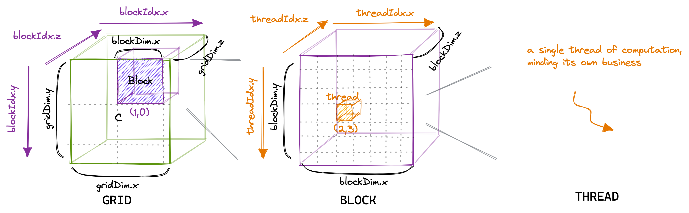

# CUDA Tutorial Notes

## 线程结构与索引方式

### 线程结构

- Thread: 一个 CUDA Kernel 可以被多个 threads 来执行
- Block: 多个 threads 会组成一个 Block，而同一个 block 中的 threads 可以同步，也可以通过 shared memory 通信
- Grid: 多个 blocks 可以组成一个 Grid

### 线程索引

- `blockDim.x,y,z` gives the number of threads in a block, in the particular direction
- `gridDim.x,y,z` gives the number of blocks in a grid, in the particular direction
- `blockDim.x * gridDim.x` gives the number of threads in a grid (in the x direction, in this case)



## 优化矩阵乘

### 使用Share Memory

A100内存层次结构如下：


每个SM上拥有共享内存，在thread之间共享，可配置大小，和L1 Cache共用空间

使用Share Memory的方法就是循环展开，加载一部分数据到数组中，每次针对小数组做运算，而非对整个大数据，小数组对应的就是共享内存


```cpp
/**
  * @brief In this design, we use BLOCK_SIZE * BLOCK_SIZE threads in a block,
  * and each thead calculate a element in C, which means that each thread need to traverse whole row of A and column of B,
  * luckily we have BLOCK_SIZE * BLOCK_SIZE share memory, thus can reduce global memory access times to K / BLOCK_SIZE,
  * to balance the memory access cost, each threads load one element from A and B to share memory,
  * the outer loop switch Share Memory to traverse A's row and B's column
  * So, we use (M / BLOCK_SIZE) * (N / BLOCK_SIZE) blocks totally as grid
  * 
  */

// 推进指针到起始位置
A += cRow * BLOCKSIZE * K;                    // 行=cRow，列=0
B += cCol * BLOCKSIZE;                        // 行=0，列=cCol
C += cRow * BLOCKSIZE * N + cCol * BLOCKSIZE; // 行=cRow，列=cCol

float tmp = 0.0;
// 外部循环推进 A 沿列和 B 沿行，直到我们完全计算出 C 中的结果。
for (int bkIdx = 0; bkIdx < K; bkIdx += BLOCKSIZE) {
  // 每个线程从全局内存加载 A 和 B 中的一个元素到共享内存中。
  // 将 threadCol（=threadIdx.x）设为连续的索引，以允许全局内存访问协同。
  As[threadRow * BLOCKSIZE + threadCol] = A[threadRow * K + threadCol];
  Bs[threadRow * BLOCKSIZE + threadCol] = B[threadRow * N + threadCol];

  // 阻塞本块内的线程，直到缓存完全填充
  __syncthreads();

  // 在当前缓存块上执行点积
  for (int dotIdx = 0; dotIdx < BLOCKSIZE; ++dotIdx) {
    tmp += As[threadRow * BLOCKSIZE + dotIdx] *
            Bs[dotIdx * BLOCKSIZE + threadCol];
  }
  // 在最后需要再次同步，以避免更快的线程在较慢的线程完成之前将下一个块提取到缓存中
  __syncthreads();

  // 推进指针到下一个块
  A += BLOCKSIZE;
  B += BLOCKSIZE * N;
}
C[threadRow * N + threadCol] = tmp;
```

### 使用Thread Tile

继续在STMD的层面上进行循环展开，单条线程处理多条数据


```cpp
/**
  * @brief In this design, we use (BM * BN) / TM threads in a block,
  * and each thead calculate TM elements in C's column, which means that each thread need to traverse in TM rows of A and 1 column of B,
  * so, blockDim can be (BM / TM, BN)
  * we use (BM * BN) / TM share memory, and to balance the memory access cost, each threads load one element from A and B to share memory,
  * the outer loop switch Share Memory to traverse A's row and B's column
  * the middle loop calculate BK elements in share memory block
  * the inner loop calculate TM elements in C colomn
  * So, we use (M / BM) * (N / BN) blocks totally as grid
  * 
  */

// 为寄存器文件分配线程本地缓存
float threadResults[TM] = {0.0};

// 外循环遍历
for (uint bkIdx = 0; bkIdx < K; bkIdx += BK) {
  // 填充SMEM缓存（与之前相同）
  As[innerRowA * BK + innerColA] = A[innerRowA * K + innerColA];
  Bs[innerRowB * BN + innerColB] = B[innerRowB * N + innerColB];
  __syncthreads();

  // 推进外循环的指针
  A += BK;
  B += BK * N;

  // 计算每个线程的结果
  for (uint dotIdx = 0; dotIdx < BK; ++dotIdx) {
    // 我们将点积循环放在外循环中，这有助于重用Bs，我们可以将其缓存在tmp变量中。
    float Btmp = Bs[dotIdx * BN + threadCol];
    for (uint resIdx = 0; resIdx < TM; ++resIdx) {
      threadResults[resIdx] +=
          As[(threadRow * TM + resIdx) * BK + dotIdx] * Btmp;
    }
  }
  __syncthreads();
}

// 将结果写回GMEM
for (uint resIdx = 0; resIdx < TM; ++resIdx) {
  C[(threadRow * TM + resIdx) * N + threadCol] = threadResults[resIdx];
}
```